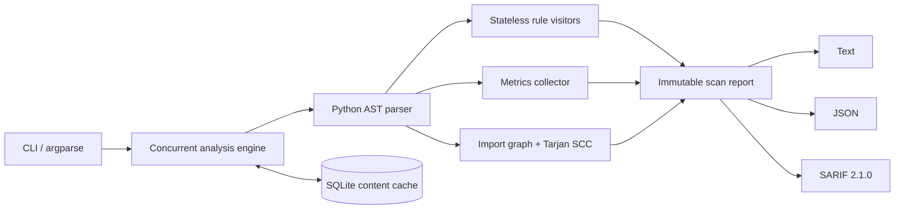

# Python Code Health Analyzer

A fast, dependency-free static analyzer that inspects Python source without executing it. It
finds correctness and security risks, measures cyclomatic complexity, detects internal import
cycles, and emits reports for humans or CI systems.

This is a portfolio project built to demonstrate production-oriented Python: AST traversal,
immutable data models, concurrent execution, content-addressed caching, graph algorithms,
typed APIs, packaging, automated tests, and continuous integration.

## What it detects

| Rule | Severity | Detection |
| --- | --- | --- |
| `CH000` | High | Unreadable source or syntax errors |
| `CH001` | High | Mutable function defaults such as `items=[]` |
| `CH002` | High | Risky calls such as `eval`, `exec`, and unsafe deserialization |
| `CH003` | Medium | Bare or overly broad exception handlers |
| `CH004` | Medium | Blocking calls such as `time.sleep` inside `async def` |
| `CH005` | Medium | Functions above the configured cyclomatic-complexity limit |

It also builds an internal module graph and uses Tarjan's strongly connected components
algorithm to report circular imports.

## Quick start

Python 3.11 or newer is required.

```bash
python -m venv .venv
# Windows: .venv\Scripts\activate
# macOS/Linux: source .venv/bin/activate
python -m pip install -e ".[dev]"
code-health scan .
```

Example output:

```text
Code health score: 86/100
Scanned 4 file(s); found 2 issue(s).
app/service.py:18:20 HIGH   CH001 [collect] Mutable default arguments persist across calls...
app/worker.py:31:5 MEDIUM CH004 [time.sleep] Blocking call `time.sleep` inside async code...
```

## CLI

```bash
# Human-readable report
code-health scan src

# Machine-readable report
code-health scan src --format json --output report.json

# GitHub-compatible static-analysis output
code-health scan src --format sarif --output report.sarif

# Fail CI when medium/high issues exist
code-health scan . --fail-on medium

# Tune concurrency and complexity policy
code-health scan . --workers 8 --max-complexity 12
```

The default SQLite cache is stored at `.code-health/cache.db`. Cache entries are keyed by the
source SHA-256, active rules, and complexity threshold, so changing code or policy invalidates
the entry. Use `--no-cache` for a clean scan.

## Architecture



Key design decisions:

- **Safe analysis:** target code is parsed, never imported or executed.
- **Deterministic output:** files and findings are sorted after concurrent analysis.
- **Thread-safe rules:** every rule creates a new visitor, while rule objects remain stateless.
- **Thread-safe cache access:** workers use short-lived SQLite connections with WAL enabled.
- **Extensible checks:** implement the small `Rule` abstraction and inject a custom rule tuple.
- **CI interoperability:** SARIF output can feed code-scanning platforms.

## Development

```bash
ruff check .
mypy
pytest
code-health scan . --no-cache --fail-on high
```

The GitHub Actions matrix runs linting, strict type checking, tests with coverage, and a
self-scan on Python 3.11 and 3.13 across Linux and Windows.

## Interview discussion guide

If you use this project in an interview, be ready to explain these choices in your own words:

1. **Why AST instead of regex?** The parser understands Python syntax and source locations,
   avoiding many multiline and nesting errors caused by text matching.
2. **Why threads?** Reading many small files is partly I/O-bound. Threads keep the design
   simple, while deterministic sorting removes scheduling differences from the output.
3. **Why not execute imports?** Static analysis must not trigger application side effects or
   run untrusted repository code.
4. **How is cache correctness maintained?** The key combines a source digest with analysis
   policy. A code or configuration change produces a miss.
5. **What would you build next?** Configuration through `pyproject.toml`, plugin discovery,
   changed-files-only scans, richer data-flow analysis, and benchmark-driven process workers.

## Limitations

This first version performs syntax-tree and import-graph analysis, not full type or data-flow
inference. Aliased calls can evade qualified-name rules, dynamically constructed imports are
not visible statically, and the score is a transparent heuristic rather than a universal quality
measurement.

## License

MIT
