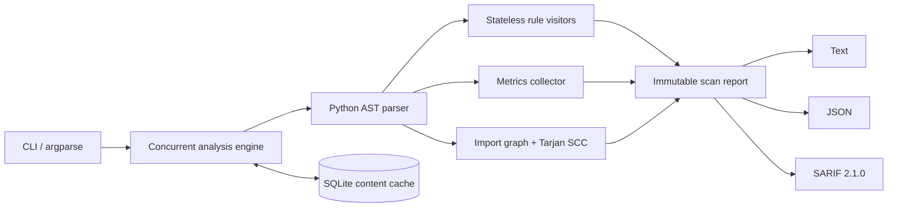

# Python Code Health Analyzer

[](https://github.com/Johnkothapalli/python-code-health-analyzer/actions/workflows/ci.yml)
[](LICENSE)
[](https://www.python.org/)

A fast, dependency-free static analyzer that inspects Python source without executing it. It
finds correctness and security risks, measures cyclomatic complexity, detects internal import
cycles, and emits reports for humans or CI systems.

The analyzer is in alpha. Reports are deterministic and suitable for local development or CI,
but the rule set is intentionally small and does not replace a type checker or a security audit.

## What it detects

| Rule | Severity | Detection |
| --- | --- | --- |
| `CH000` | High | Unreadable source or syntax errors |
| `CH001` | High | Mutable function defaults such as `items=[]` |
| `CH002` | High | Risky calls such as `eval`, `exec`, and unsafe deserialization |
| `CH003` | Medium | Bare or overly broad exception handlers |
| `CH004` | Medium | Blocking calls such as `time.sleep` inside `async def` |
| `CH005` | Medium | Functions above the configured cyclomatic-complexity limit |

It also builds an internal module graph and uses Tarjan's strongly connected components
algorithm to report circular imports.

## Quick start

Python 3.11 or newer is required.

The package is not on PyPI yet. Install the `v0.1.0` release directly from GitHub:

```bash
python -m pip install "https://github.com/Johnkothapalli/python-code-health-analyzer/releases/download/v0.1.0/python_code_health_analyzer-0.1.0-py3-none-any.whl"
code-health scan .
```

To follow the latest `main` branch instead:

```bash
python -m pip install "git+https://github.com/Johnkothapalli/python-code-health-analyzer.git"
code-health scan .
```

For local development:

```bash
git clone https://github.com/Johnkothapalli/python-code-health-analyzer.git
cd python-code-health-analyzer
python -m venv .venv
# Windows: .venv\Scripts\activate
# macOS/Linux: source .venv/bin/activate
python -m pip install -e ".[dev]"
code-health scan .
```

Example output:

```text
Code health score: 86/100
Scanned 4 file(s); found 2 issue(s).
app/service.py:18:20 HIGH   CH001 [collect] Mutable default arguments persist across calls...
app/worker.py:31:5 MEDIUM CH004 [time.sleep] Blocking call `time.sleep` inside async code...
```

## CLI

```bash
# Human-readable report
code-health scan src

# Machine-readable report
code-health scan src --format json --output report.json

# GitHub-compatible static-analysis output
code-health scan src --format sarif --output report.sarif

# Fail CI when medium/high issues exist
code-health scan . --fail-on medium

# Tune concurrency and complexity policy
code-health scan . --workers 8 --max-complexity 12

# Exclude project-specific generated or vendored directories
code-health scan . --exclude-dir generated --exclude-dir vendor
```

The default SQLite cache is stored at `.code-health/cache.db`. Cache entries are keyed by the
source SHA-256, active rules, and complexity threshold, so changing code or policy invalidates
the entry. Use `--no-cache` for a clean scan.

The command returns `0` when the scan completes and no finding meets `--fail-on`. It returns `1`
when a finding reaches the configured threshold. Invalid arguments or a missing target produce a
usage error. This makes `--fail-on` suitable for CI without treating lower-severity findings as a
failed scan.

## Architecture



Key design decisions:

- **Safe analysis:** target code is parsed, never imported or executed.
- **Deterministic output:** files and findings are sorted after concurrent analysis.
- **Thread-safe rules:** every rule creates a new visitor, while rule objects remain stateless.
- **Thread-safe cache access:** workers use short-lived SQLite connections with WAL enabled.
- **Extensible checks:** implement the small `Rule` abstraction and inject a custom rule tuple.
- **CI interoperability:** SARIF output can feed code-scanning platforms.

## Development

```bash
ruff check .
mypy
pytest
code-health scan . --no-cache --fail-on high
```

The GitHub Actions matrix runs linting, strict type checking, tests with coverage, and a
self-scan on Python 3.11 and 3.13 across Linux and Windows.

## Contributing

Issues and pull requests are welcome. Start with [CONTRIBUTING.md](CONTRIBUTING.md), browse the
[`good first issue`](https://github.com/Johnkothapalli/python-code-health-analyzer/labels/good%20first%20issue)
label, or read [the rule-authoring guide](docs/adding-a-rule.md). Larger changes should begin
with an issue so the design can be agreed before implementation.

The public direction of the project is recorded in [ROADMAP.md](ROADMAP.md), and released
changes are recorded in [CHANGELOG.md](CHANGELOG.md).

Release maintainers should follow the token-free [release process](RELEASING.md).

For usage questions, use
[GitHub Discussions](https://github.com/Johnkothapalli/python-code-health-analyzer/discussions).
Report vulnerabilities through the private process in [SECURITY.md](SECURITY.md).

## Limitations

This first version performs syntax-tree and import-graph analysis, not full type or data-flow
inference. Aliased calls can evade qualified-name rules, dynamically constructed imports are
not visible statically, and the score is a transparent heuristic rather than a universal quality
measurement.

## License

MIT
